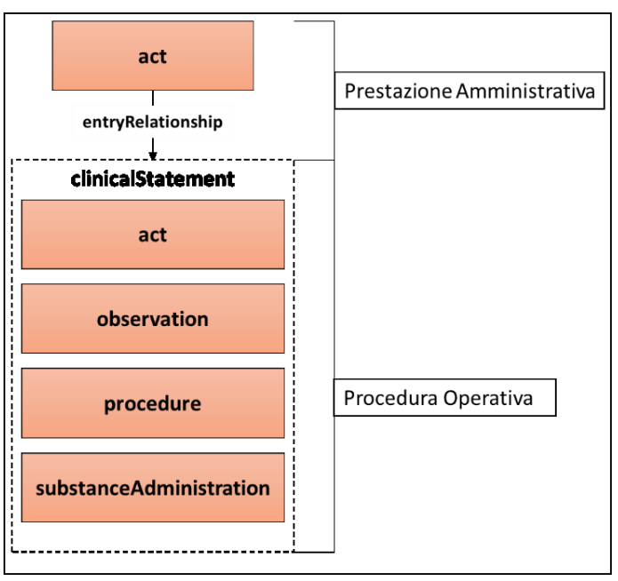

## Referto di Specialistica Ambulatoriale (RSA)
Il Referto di Specialistica Ambulatoriale è finalizzato a definire uno standard per la refertazione di prestazioni ambulatoriali specialistiche (visite mediche ed esami strumentali) che non ricadano nella sfera della medicina di laboratorio, della radiologia ed imaging, dell'anatomia patologica.
Il Referto di Specialistica Ambulatoriale può essere indirizzato sia ad un altro Specialista sia al Medico di Medicina Generale.
### Header
- ***code***: esempio di utilizzo
  ```xml
  <code code="11488-4"
    codeSystem="2.16.840.1.113883.6.1"
    codeSystemName="LOINC"
    codeSystemVersion="2.64"
    displayName="Nota di consulto">
  </code>
  ```
## Body
Lo standard CDA prevede che il corpo di un documento possa essere formato in modo strutturato (```<structuredBody>```) o in modo destrutturato (```<nonXMLBody>```).
Un referto di radiologia è organizzato in una serie di sezioni autoconsistenti, definiti dall’elemento ```<section>```.
Le sezioni OBBLIGATORIE nel caso del RSA:
 | Sezioni        | Codici LOINC | Descrizioni LOINC ShortName                     |
  |----------------|--------------|-------------------------------------------------|
  | Prestazioni | 62387-6      | Interventi |
  | Referto        | 47045-0      | Referto                     |

  - **Prestazioni**: Elemento OBBLIGATORIO atto a riportare le prestazioni amministrative erogate, a cui il referto specialistico fa riferimento, e, ove applicabile, le procedure operative e cliniche eseguite (es. somministrazione farmaci).
    > Una possibile estensione è l'introduzione OPZIONALE delle _prestazioni operative_ associate a quelle _amministrative_ tramite il campo ```entryRelationship```.
    
    * ***code***: esempio di utilizzo.
    ```xml
    <code code="11488-4"
          codeSystem="2.16.840.1.113883.6.1"
          codeSystemName="LOINC"
          codeSystemVersion="2.64"
          displayName="Nota di consulto">
    </code>
    ```
    * ***title***: esempio di utilizzo, ```<title> Prestazioni </title>```
    * ***text***: inserire tutte le informazioni “human-readable”;
    * ***entry***: consente di rappresentare in modo strutturato le informazioni di dettaglio riferite nel blocco narrativo.
      - ***act***:  descrivere le prestazioni amministrative eseguite.

    <figure>
      
      <figcaption>Struttura della Entry</figcaption>
    </figure>
  - **Referto**: atto a riportare quanto emerso nel corso della/e prestazione/i, riporta quindi al proprio interno una descrizione delle valutazioni del medico e dell’esito della prestazione.
    - ***code***: definisce la tipologia di __section__. 
    ```xml
    <code code=“47045-0 “
          codeSystem=“2.16.840.1.113883.6.1”
          codeSystemName=“LOINC”
          codeSystemVersion=“2.64”
          displayName=“Referto”/>
    ```
    >  - la sezione Referto DEVE avere un elemento ``<title>``
    > - la sezione Referto DEVE avere un elemento ``<text>`` contenente
    >   tutte le informazioni esposte in modo narrativo (“human-readable”).

    